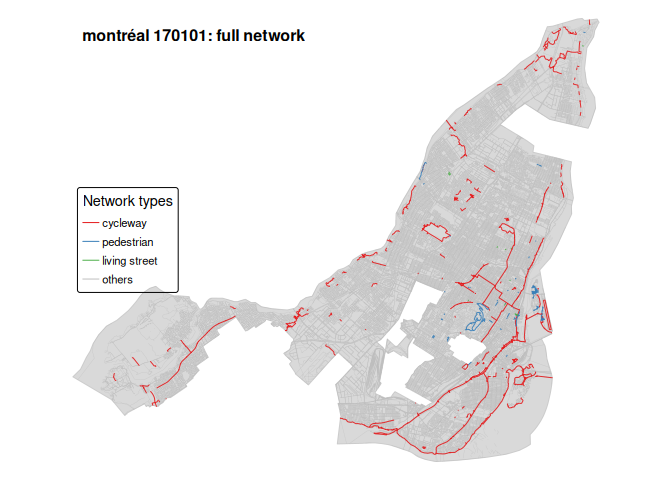
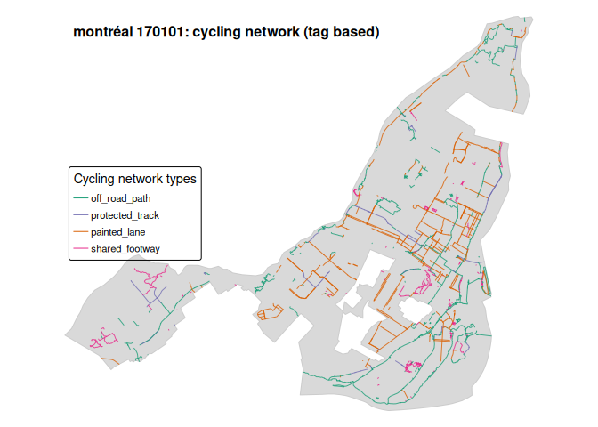
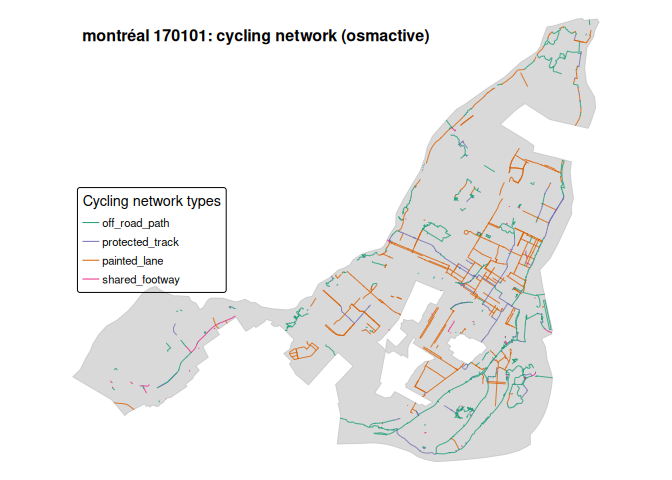

# Getting historical OSM infrastructure data

# What this repository does

This repository shows how to extract, classify, and map historical
OpenStreetMap (OSM) street networks for a city.

The workflow has two main components:  
(1) classification of the **full street network**, and  
(2) classification of the **cycling network** using two alternative
methods.

------------------------------------------------------------------------

## 1. Full street network (classified by highway type)

We first download the complete OSM street network for the selected city
and snapshot using  
`osmactive::get_travel_network()` (which internally relies on
`osmextract::oe_get()`, but is fully handled by `osmactive`).

Each street segment is then assigned to one of four broad categories
using only the value of the `highway` tag:

- **cycling**: `highway = cycleway`  
- **pedestrian**: `highway = pedestrian`  
- **living street**: `highway = living_street`  
- **others**: all remaining highway types

This provides a simple, high-level overview of the street network.

At this stage we do **not** include on-road cycling infrastructure
appearing on other road types  
(e.g. `cycleway = lane`, `cycleway = track`, `bicycle = designated`).  
These elements are classified later as part of the cycling network.

------------------------------------------------------------------------

## 2. Cycling network (classified by infrastructure type)

We next build a cycling-specific network from OSM, classifying links
into a simplified scheme  
stored in the variable `infra_simple`, which includes:

- **protected_track**  
- **painted_lane**  
- **shared_footway**  
- **off_road_path**

We implement this using **two alternative methods**, allowing results to
be compared.

### a) Custom tag-based classification (using OSM tags)

In the first method, we construct the cycling network and its categories
directly from OSM tags.  
We use explicit filtering and classification rules based on combinations
of:

- `highway`
- `cycleway` (lane, track, sharrows, opposite lanes, etc.)
- `bicycle` access
- `segregated`
- paths and footways with bicycle permissions

These rules identify all links functioning as cycling infrastructure,
which we then collapse into the four `infra_simple` classes.  
This method is fully transparent and can be adapted to different local
definitions of cycling infrastructure.

### b) *osmactive*-based classification

In the second method, we rely on the **osmactive** package’s internal
cycling classification.  
osmactive returns a more detailed set of infrastructure types for
cycling links.  
We then map these detailed osmactive classes onto the same four
`infra_simple` categories used in the custom tag-based method.

This provides a convenient, package-based classification that can be
compared directly with our own tag-based scheme.

------------------------------------------------------------------------

## Running the workflow

The workflow runs **one city** and **one historical OSM snapshot** at a
time.

The repository consists of six R scripts:

- `R/00_setup.R` \# city tag, city name, file paths, infra_region,
  snapshot_version  
- `R/01_get_boundary.R` \# build city perimeter  
- `R/02_get_infrastructure.R` \# download / load OSM travel network  
- `R/03_full_network.R` \# classify full street network (highway
  groups)  
- `R/04_cycling_network.R` \# build and classify cycling networks (two
  methods)  
- `R/05_city_maps.R` \# plotting functions (full and cycling maps)

In the example, we use the **2016** OSM snapshot for **Montréal,
Canada**.

> [!TIP]
>
> ### How to change city and year
>
> #### 1. Set the city and default snapshot (`R/00_setup.R`)
>
> Edit these lines:
>
>     city_name           <- "Montréal"
>     city_tag            <- "montréal"
>     city_boundary_place <- "Montréal, Canada"
>
>     # Region used by osmextract::oe_get() (must fully contain the city)
>     infra_region <- "Québec"
>
>     # Default historical OSM snapshot
>     snapshot_version    <- "170101"   # e.g. ~2016
>
> To switch city (and its default year), change these values. For
> example, for Paris around 2023:
>
>     city_name           <- "Paris"
>     city_tag            <- "paris"
>     city_boundary_place <- "Paris, France"
>     infra_region        <- "Ile-de-France"
>     snapshot_version    <- "240101"   # e.g. ~2023
>
> #### 2. Download or load the OSM network
>
> We work with historical OSM snapshots identified by version codes, for
> example:
>
> - “170101” → approx 2016
>
> - “240101” → approx 2023
>
> Run:
>
>     source("R/00_setup.R")
>     source("R/01_get_boundary.R")
>     source("R/02_get_infrastructure.R")
>
>     build_city_boundary()
>
>     # Download the network for the snapshot defined in snapshot_version:
>     get_osm_infrastructure()
>     # (you can override it if needed: get_osm_infrastructure(version = "170101"))
>
> This creates:
>
>     data/<city_tag>/<city_tag>_<version>_lines.gpkg
>
> You only need to download each city–version combination once.
>
> #### 3. Classify and plot the networks
>
>     source("R/03_full_network.R")
>     source("R/04_cycling_network.R")
>     source("R/05_city_maps.R")
>
>     # Full street network (4 highway groups)
>     plot_city_map_full_tm()
>
>     # Cycling network (custom tag-based classification)
>     plot_city_map_cycling_tag_tm()
>
>     # Cycling network (osmactive-based classification)
>     plot_city_map_cycling_osmactive_tm()
>
> #### Summary
>
> - **Change city and default year**: update `city_name`, `city_tag`,
>   `city_boundary_place`, `infra_region`, and `snapshot_version` in
>   `R/00_setup.R`.
>
> - **Download**: run `build_city_boundary()` and
>   `get_osm_infrastructure()` once per city–snapshot.
>
> - **Plot**: use `plot_city_map_full_tm()`,
>   `plot_city_map_cycling_tag_tm()`, and
>   `plot_city_map_cycling_osmactive_tm()`.
>
> The rest of the workflow adapts automatically.

