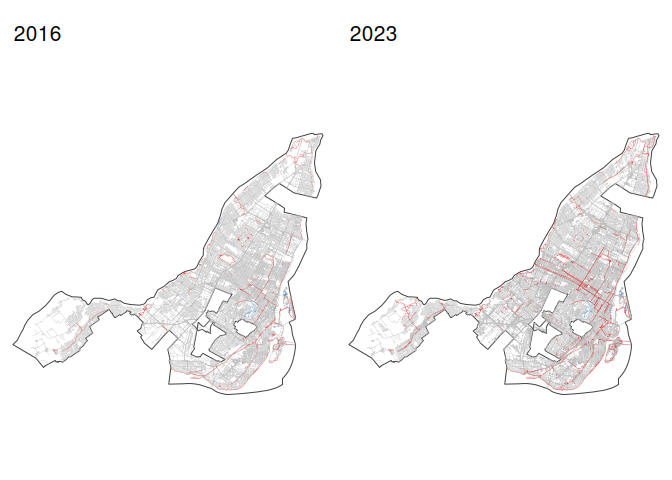
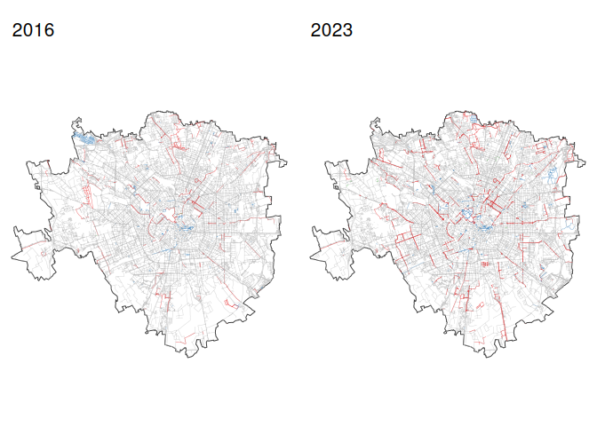
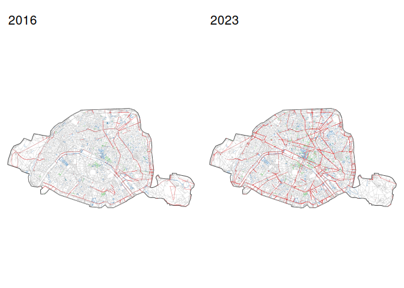

# Getting historical OSM infrastruture data

## What this repository does

We work with historical OSM data to do two related tasks.

### 1. Street network with broad categories

First, we download the full street network for each city and classify
links into four simple groups using **only** the OSM `highway` tag:

- **cycling**: `highway = cycleway`
- **pedestrian**: `highway = pedestrian`
- **living street**: `highway = living_street`
- **others**: all remaining `highway` types

This gives a clean, broad picture of the street network.  
At this stage we do **not** try to capture all on-road cycling
infrastructure  
(for example `cycleway = lane` or `cycleway = track` on other road
types).

### 2. Cycling network by type

Second, we will build a **cycling-only network** and group links into a
few  
infrastructure types (for example protected tracks, painted lanes, mixed
traffic).

This step will use additional cycling-related OSM tags (such as
`cycleway*` and `bicycle*`)  
and is still under development in this repository.

We will use two workflows for this task:

- **(A) Custom filter using `osmextract`**  
  Slower, but provides full control over OSM tags and classification.

- **(B) Built-in extractor using `osmactive`**  
  Faster and simpler, but relies on the package’s predefined cycling
  filters.

As an example, we work with Barcelona, Montréal, Milan and Paris, using
OSM snapshots from 2017 and 2024.

## Street network categories

## Cycling network by type
